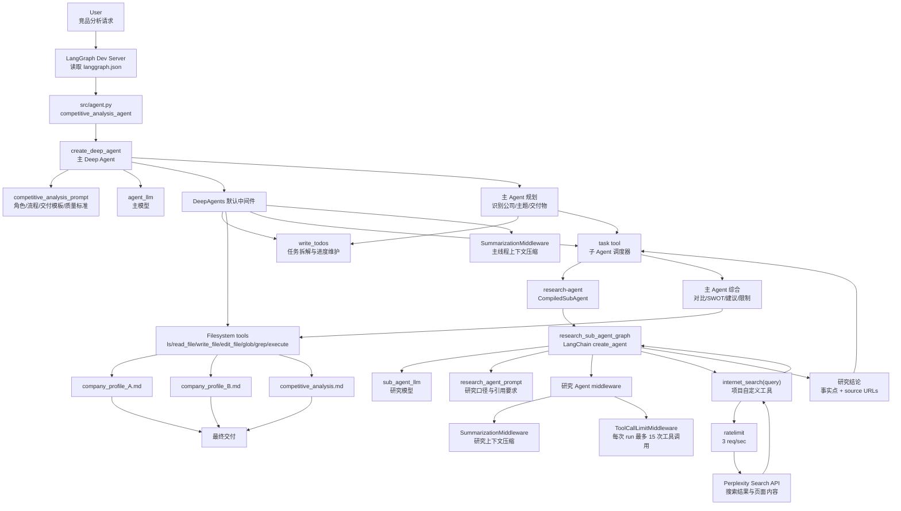

# Agent Interaction Diagram

这张图用于理解 `deep-competitive-analyst` 的 Agent 交互细节。它对应第二课的深水区：一次竞品分析请求进入后，主 Agent、子 Agent、工具、runtime 和文件输出如何协作。

## 一张图看懂交互



## 读图顺序

1. 用户输入一个竞品分析任务，比如比较 Linear 和 Asana。
2. `langgraph dev` 读取 `src/langgraph.json`，找到 `./agent.py:competitive_analysis_agent`。
3. `src/agent.py` 调用 `create_deep_agent(...)` 生成主 Deep Agent。
4. 主 Agent 拿到三类关键能力：
   - 主 prompt：决定它要像竞品分析师一样工作。
   - 主模型：负责规划、调度、综合和写报告。
   - research sub-agent：负责被委派做外部信息调研。
5. `deepagents` 框架自动给主 Agent 注入工具：
   - `write_todos`：维护任务清单。
   - 文件系统工具：读写最终报告。
   - `task`：启动短生命周期子 Agent。
6. 主 Agent 先拆任务，然后通过 `task` tool 调用 `research-agent`。
7. research-agent 内部是一个 LangChain agent，它只接了一个项目自定义工具：`internet_search`。
8. `internet_search` 调用 Perplexity Search API，并通过 `ratelimit` 限制到每秒 3 次请求。
9. research-agent 把搜索后的结论和 source URLs 返回给主 Agent。
10. 主 Agent 综合多个研究结果，最后用文件工具写出三个 Markdown 报告。

## 更深一层：这里到底有哪些 Agent

这个项目里至少有两层 Agent：

```text
主 Deep Agent
└── research-agent
```

但严格说，主 Agent 获得 research-agent 的方式不是直接函数调用，而是通过 deepagents 注入的 `task` tool。

所以更准确的链路是：

```text
主 Agent -> task tool -> research-agent runnable -> internet_search -> Perplexity
```

这个细节很重要，因为它解释了为什么子 Agent 是“隔离上下文”的：

1. 主 Agent 不需要保留所有搜索过程细节。
2. 子 Agent 只把最终研究结论返回给主 Agent。
3. 这样可以降低主上下文膨胀。
4. 多个独立主题可以并行委派。

## 主 Agent 的职责

主 Agent 更像项目经理 + 资深分析师：

1. 理解用户要比较哪些公司和场景。
2. 拆成公司背景、产品、价格、客户、近期动态、优劣势等研究任务。
3. 维护 todo list，避免遗漏。
4. 调用 research-agent 获取证据。
5. 判断信息是否足够、是否平衡。
6. 综合成 SWOT、产品对比、买家建议和结论。
7. 写出最终 Markdown 文件。

对应源码：

```text
D:\deep-competitive-analyst\src\agent.py
D:\deep-competitive-analyst\src\prompts.py
```

## research-agent 的职责

research-agent 更像调研分析师：

1. 接收一个聚焦问题。
2. 调用 `internet_search` 搜索公开资料。
3. 记录具体数据点、日期、价格、功能、source URLs。
4. 如果找不到信息，要说明限制。
5. 最终只返回一份完整研究结果。

对应源码：

```text
D:\deep-competitive-analyst\src\sub_agents.py
D:\deep-competitive-analyst\src\tools.py
```

## 为什么这个设计比单 Agent 更好

如果只用一个大 prompt 做所有事，会有几个问题：

1. 搜索过程太长，主上下文会被大量网页细节淹没。
2. 不同研究主题混在一起，容易遗漏或失衡。
3. 无法自然并行。
4. 很难控制每个研究任务的工具调用次数。
5. 最终报告可能被早期搜索结果带偏。

这个项目通过主 Agent + research-agent 拆层，让系统变成：

```text
主 Agent 管战略和交付
子 Agent 管局部事实调研
工具管外部信息获取
middleware 管上下文和工具调用边界
```

## 面试表达

> 这个项目的交互核心是主 Agent 通过 `task` 工具委派 research-agent 做隔离式调研。主 Agent 负责任务拆解、调度、综合分析和报告写入；research-agent 负责围绕具体主题调用 Perplexity 搜索并返回带引用的事实结果。DeepAgents 框架还自动注入了 todo、文件系统和子 Agent 调度工具，所以 `agent.py` 虽然只有几行，但背后实际展开的是一个带规划、工具调用、上下文压缩和文件交付能力的 LangGraph 工作流。

## 面试官可能追问

问题：这个架构的风险是什么？

回答：

> 风险主要在三个地方。第一，主 Agent 可能拆解不合理，导致研究主题不平衡。第二，research-agent 的搜索结果依赖 Perplexity，可能遇到限流、信息过时或来源质量问题。第三，长流程会带来成本和稳定性风险，所以需要工具调用上限、缓存、trace、失败重试和人工确认机制。

问题：为什么 research-agent 要有 ToolCallLimitMiddleware？

回答：

> 因为搜索型 Agent 很容易陷入重复搜索或过度搜索。给 research-agent 设置工具调用上限，可以控制成本和运行时间，也能避免一个子任务拖垮整个主流程。

问题：为什么主 Agent 和子 Agent 都用了 SummarizationMiddleware？

回答：

> 因为竞品分析是长上下文任务。搜索结果、网页内容和多轮中间状态会快速膨胀。总结中间件可以压缩历史上下文，让 Agent 在长流程中继续保留关键事实，同时降低上下文超限的风险。

