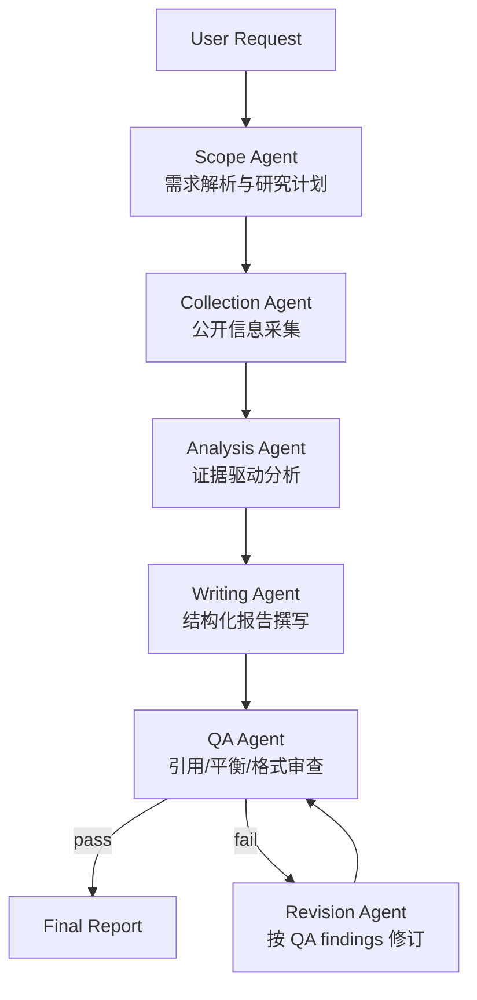

# AI 驱动的竞品分析 Agent 协作系统 V2

## 项目定位

本项目基于 `deep-competitive-analyst` 改造，目标是打造一个更适合 AI 岗位面试展示的“竞品分析 Agent 协作系统”。

原项目已经具备：

1. 主 Agent + research-agent 的多 Agent 雏形。
2. Perplexity Search 外部信息采集。
3. Markdown 报告生成。
4. LangGraph 本地运行入口。

V2 的目标是进一步升级为：

```text
采集 Agent -> 分析 Agent -> 撰写 Agent -> 质检 Agent -> 修订闭环
```

并且围绕统一竞品知识 Schema、证据链、DAG 流转和可观测性构建。

## 课题需求拆解

用户需求中的关键要求：

1. 多个专职 Agent 协同。
2. 自动完成公开信息采集到结构化竞品报告输出。
3. 至少包含采集、分析、撰写、质检 Agent。
4. 基于自定义竞品知识 Schema 协作。
5. 形成 DAG 式任务流转。
6. 支持交叉审查反馈闭环。
7. 强调结果溯源能力。
8. 强调系统可观测性。
9. 每条分析结论有据可查。
10. 每个 Agent 的决策过程与中间产物透明。

## V2 架构目标

### Agent 角色

1. Scope Agent
   - 识别用户要比较的公司、行业、地域、目标受众和分析重点。
   - 产出 `ResearchPlan`。

2. Collection Agent
   - 调用搜索工具采集公开资料。
   - 按公司和主题归档 sources、evidence、raw snippets。
   - 产出 `CompetitorKnowledgeBase`。

3. Analysis Agent
   - 基于 evidence 生成 claims。
   - 每个 claim 必须绑定 evidence ids。
   - 产出 SWOT、差异化、机会点、风险点。

4. Writing Agent
   - 基于结构化知识库和 claims 写报告。
   - 产出 `ReportDraft`。

5. QA Agent
   - 检查 citation coverage、source quality、recency、balance、format。
   - 产出 `QualityReview`。

6. Revision Agent
   - 根据 QA findings 修订报告。
   - 如果仍不合格，保留 QA findings，不伪造证据。

## DAG 任务流



## 自定义竞品知识 Schema

V2 会用统一 schema 贯穿所有 Agent：

```text
SourceRecord
EvidenceRecord
ClaimRecord
CompanyFactSheet
CompetitorKnowledgeBase
ReportDraft
QualityReview
AgentTraceEvent
```

核心原则：

1. source 记录“信息来自哪里”。
2. evidence 记录“来源里哪段内容支持判断”。
3. claim 记录“分析结论是什么，以及由哪些 evidence 支持”。
4. report 只能引用 claim，不应该凭空生成事实。
5. trace 记录每个 Agent 的输入、输出、决策和 artifact。

## 溯源设计

每条 claim 必须满足：

```text
claim.text
claim.company
claim.category
claim.evidence_ids
claim.confidence
```

QA Agent 检查：

1. 是否存在无 evidence 的 claim。
2. evidence 是否能找到对应 source。
3. source 是否有 URL。
4. source 是否有 retrieved_at。
5. source type 是否明确。

## 可观测性设计

每个 Agent 节点都写入 `AgentTraceEvent`：

```text
agent_name
stage
input_summary
output_summary
artifact_ids
decision
warnings
created_at
```

这样面试时可以说明：

> 我们不是只看最终报告，而是能追踪每个 Agent 做了什么、为什么这么做、产生了哪些中间产物。

## 与原项目的关系

原项目保留：

1. `src/agent.py`
2. `src/sub_agents.py`
3. `src/tools.py`
4. `src/prompts.py`

V2 新增：

1. `src/competitive_schema.py`
2. `src/v2_prompts.py`
3. `src/v2_workflow.py`

并在 `src/langgraph.json` 中新增第二个 graph：

```text
competitive_analysis_v2
```

这样可以同时保留原 demo 和我们的新项目。

## 第一阶段实现边界

第一阶段先完成：

1. Schema 定义。
2. DAG graph 可编译。
3. 每个 Agent 节点产生 trace。
4. QA 闭环可运行。
5. LangGraph validate 通过。

第一阶段不会伪造真实竞品结论。如果没有真实搜索 API key 或未执行采集，系统会明确输出“证据不足”，而不是编造报告。

当前第一阶段已扩展完成：

1. 支持 seed records 演示完整证据链。
2. 支持 live collection 开关。
3. 在没有 `PERPLEXITY_API_KEY` 时不会 import Perplexity 工具或伪造来源。
4. CLI 可导出 report、state、trace、artifacts。
5. QA Agent 可检查 citation coverage、source availability、evidence availability、source type 和公司证据平衡。
6. SourceRecord 支持 credibility_score 和 credibility_label。
7. Live collection 支持 query cache，减少重复搜索成本。
8. 报告输出 Source Quality 表。
9. 增加 smoke test，验证无证据失败、有 seed 通过。

## 后续阶段

第二阶段：

1. 将 Collection Agent 接入 Perplexity。
2. 将搜索结果转成 `SourceRecord` 和 `EvidenceRecord`。
3. 增加 query cache。

第三阶段：

1. 使用 LLM 生成结构化 claims。
2. 增加 report reviewer。
3. 增加 citation coverage 自动评分。

第四阶段：

1. 增加 Web UI。
2. 展示 DAG 进度、trace、evidence table 和最终报告。
3. 支持导出 Markdown / PDF / DOCX。
