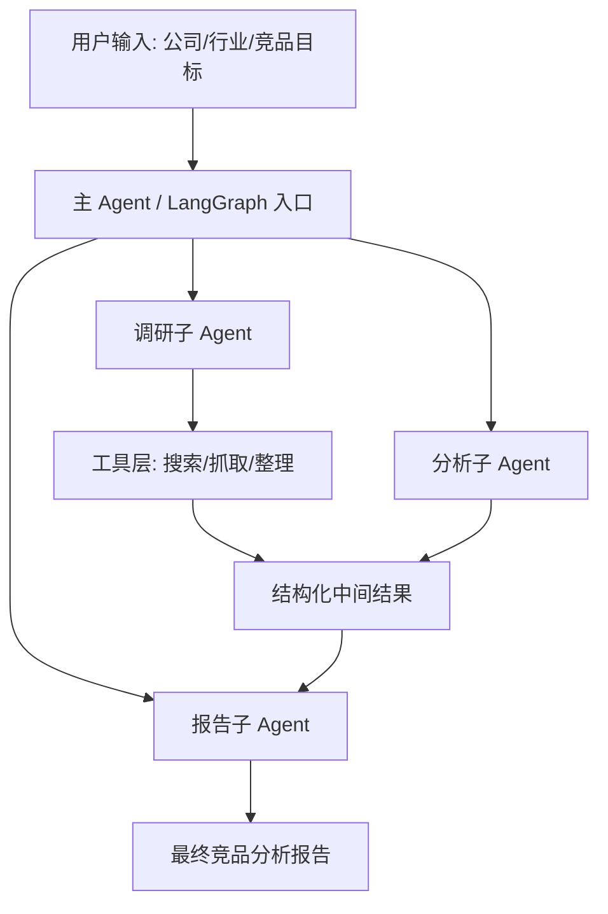

# Deep Competitive Analyst 项目掌握路线

来源项目：https://github.com/ALucek/deep-competitive-analyst

这份文档是我们后续学习这个项目的主线索引。核心目标不是“看懂 README”，而是逐步把这个项目转化成你面试时可以稳定表达、可以追问细节、可以扩展方案、可以落地改代码的能力。

## 核心要义

我们要一步步完全掌握和理解 `deep-competitive-analyst`，服务于 AI 岗位面试准备，覆盖两条视角：

1. 产品岗视角：能讲清楚它解决什么业务问题、目标用户是谁、输入输出是什么、为什么这个工作流有价值、如何评估效果、如何商业化或产品化。
2. 开发岗视角：能讲清楚它的架构、Agent 工作流、工具调用、数据模型、提示词设计、状态流转、错误处理、可扩展性、测试与部署。

最终目标是：别人问你“这个项目你做了什么、为什么这么做、如果上线会怎么改、如果让你重构会怎么做”，你都能答得具体、有层次、有工程味。

## 我们的学习原则

1. 先建立全局地图，再进入文件级细节。
2. 先讲业务闭环，再讲技术实现。
3. 每个模块都要回答三个问题：它负责什么、它依赖什么、它坏了会怎样。
4. 每个技术点都要转成面试语言：产品价值、工程权衡、可扩展方案。
5. 不只被动理解，还要主动改造：加功能、补测试、优化提示词、设计部署方案。
6. 每完成一个学习阶段，都同步更新 `CODEX_LEARNING_MEMORY.md`，把已掌握内容、面试表达和下一步计划沉淀下来。

## 初始项目判断

从 GitHub 仓库结构看，这个项目是一个基于 LangGraph / Deep Agents 思路的竞争分析 Agent 项目。它大概率由以下核心部分组成：

1. `src/agent.py`：主 Agent 或图的入口，负责组装整体分析流程。
2. `src/sub_agents.py`：拆分子 Agent，分别处理调研、分析、报告、结构化总结等任务。
3. `src/tools.py`：Agent 可调用的工具层，可能包括搜索、抓取、数据整理等。
4. `src/prompts.py`：系统提示词和任务提示词，是项目效果的核心杠杆之一。
5. `src/models.py`：结构化数据模型，定义输入输出或中间状态。
6. `src/langgraph.json`：LangGraph 运行和部署配置。

这只是第一轮结构判断。等源码进入本地后，我们会逐文件校准，不把猜测当结论。

## 第一阶段：产品级理解

目标：你能不用代码解释这个项目。

需要掌握：

1. 这个项目的用户是谁：创业者、产品经理、市场分析师、投资人、销售团队，还是 AI Agent 开发者。
2. 它解决的痛点是什么：人工竞品调研慢、信息碎片化、报告不结构化、分析口径不稳定。
3. 它的核心输入是什么：公司名、产品名、行业、竞品列表、分析目标。
4. 它的核心输出是什么：竞品画像、差异化分析、市场定位、机会点、风险点、最终报告。
5. 它的价值指标是什么：节省调研时间、提高覆盖面、减少遗漏、输出可复用报告。

面试表达模板：

> 这个项目本质上是把“竞品分析”这个高认知负荷流程拆成多个可协作的 Agent 子任务，通过工具获取外部信息，再用结构化模型和提示词把信息转化成可决策的分析报告。

## 第二阶段：架构级理解

目标：你能画出并解释系统链路。

我们会重点拆：

1. 用户请求如何进入主 Agent。
2. 主 Agent 如何决定调用哪些子 Agent。
3. 子 Agent 之间是串行、并行还是条件分支。
4. 工具调用结果如何进入状态。
5. 结构化输出如何被校验和汇总。
6. 最终报告如何生成。

候选架构图：



## 第三阶段：代码级精读

目标：你能逐文件讲清楚代码为什么这样写。

精读顺序：

1. `README.md`：先确认项目目标、安装方式、示例输入输出。
2. `src/langgraph.json`：确认运行入口和 LangGraph 配置。
3. `src/models.py`：先看数据结构，因为数据结构决定系统边界。
4. `src/prompts.py`：理解 Agent 的任务设定和输出约束。
5. `src/tools.py`：理解外部能力和工具抽象。
6. `src/sub_agents.py`：理解任务拆分方式。
7. `src/agent.py`：最后看总装配，因为此时各零件都已经有上下文。

每个文件都按这个模板记录：

1. 文件职责
2. 关键函数 / 类
3. 输入输出
4. 依赖关系
5. 面试高频问题
6. 可改进点

## 第四阶段：面试问题库

产品岗问题：

1. 为什么选择竞品分析作为 Agent 场景？
2. 这个产品的目标用户和使用频率是什么？
3. 如何判断生成的竞品报告是“好”的？
4. 如果用户不信任 Agent 的结论，你怎么设计可解释性？
5. 这个产品如何从 demo 变成可收费 SaaS？

开发岗问题：

1. 为什么要用多 Agent，而不是一个长 prompt？
2. LangGraph 在这里解决了什么问题？
3. 工具调用失败时如何降级？
4. 如何避免搜索结果幻觉或来源不可靠？
5. 如何做结构化输出校验？
6. 如何加入缓存、异步任务和队列？
7. 如何测试一个 Agent 项目？

## 第五阶段：改造路线

为了让这个项目更适合作为面试作品集，我们后续可以做这些增强：

1. 增加一键运行示例和样例报告。
2. 增加结构化输出 schema 和校验失败重试。
3. 增加来源引用和证据链。
4. 增加报告评分器，用另一个 Agent 评估报告质量。
5. 增加 Web UI 或 Streamlit 前端。
6. 增加测试，包括工具 mock、prompt 输出 contract test、端到端 smoke test。
7. 增加部署说明：本地运行、LangGraph Cloud、API 服务化。

## 源码抓取记录

本机直接执行 GitHub README 里的命令：

```bash
git clone https://github.com/ALucek/deep-competitive-analyst.git
```

失败原因不是仓库不存在，而是当前网络到 `github.com:443` 不稳定：本机可以 ping 到 GitHub，但 TCP 443 连接失败或被重置。进一步测试发现 `codeload.github.com:443`、`api.github.com:443` 和 `ssh.github.com:443` 可连通。

因此本次采用备用抓取路径：

```bash
curl.exe -k -L https://codeload.github.com/ALucek/deep-competitive-analyst/zip/refs/heads/main -o deep-competitive-analyst-main.zip
Expand-Archive -LiteralPath deep-competitive-analyst-main.zip -DestinationPath . -Force
```

随后将压缩包内的 `deep-competitive-analyst-main/` 内容移动到 `D:\deep-competitive-analyst` 根目录。

## 当前真实项目结构

```text
D:\deep-competitive-analyst
├── README.md
├── LICENSE
├── pyproject.toml
├── uv.lock
├── dca_logo.png
├── example_output/
│   ├── README.md
│   ├── company_profile_Asana.md
│   ├── company_profile_Linear.md
│   └── competitive_analysis.md
└── src/
    ├── agent.py
    ├── langgraph.json
    ├── models.py
    ├── prompts.py
    ├── sub_agents.py
    └── tools.py
```

当前项目已具备源码阅读条件。后续继续做三件事：

1. 生成真实项目结构图。
2. 逐文件写“代码讲解笔记”。
3. 基于面试目标补强代码和文档。

## 本地运行状态

已创建 conda 环境并完成第一轮运行验证：

```text
conda env: deep-competitive-analyst
python: 3.13.13
```

验证通过：

1. 项目依赖安装成功。
2. 核心 Python 包可导入。
3. `agent.competitive_analysis_agent` 可编译为 LangGraph `CompiledStateGraph`。
4. `langgraph validate` 通过。
5. 本地 LangGraph dev server 可启动到 `http://127.0.0.1:8123`。

详细命令见：

```text
D:\deep-competitive-analyst\RUNNING_LOCALLY.md
```

## 我们自己的 V2 项目

我们已经基于原项目新增 V2：

```text
AI 驱动的竞品分析 Agent 协作系统
```

V2 不再只是主 Agent + research-agent 的 demo，而是面向课题要求构建：

```text
Scope Agent -> Collection Agent -> Analysis Agent -> Writing Agent -> QA Agent -> Revision Agent
```

核心特征：

1. 自定义竞品知识 Schema。
2. DAG 式任务流转。
3. QA 交叉审查反馈闭环。
4. Source / Evidence / Claim 分层溯源。
5. 每个 Agent 输出 trace 和 artifact。
6. 不伪造无证据结论。

新增文档：

```text
D:\deep-competitive-analyst\OUR_PROJECT_V2_SPEC.md
D:\deep-competitive-analyst\RUNNING_V2.md
D:\deep-competitive-analyst\V2_ARCHITECTURE.md
```

新增代码：

```text
D:\deep-competitive-analyst\src\competitive_schema.py
D:\deep-competitive-analyst\src\v2_prompts.py
D:\deep-competitive-analyst\src\v2_workflow.py
D:\deep-competitive-analyst\src\v2_cli.py
```

新增 LangGraph graph：

```text
competitive_analysis_v2
```

V2 当前可演示能力：

1. 无 API key 时可用 `examples/v2_seed_records.json` 跑通证据链。
2. 有 `PERPLEXITY_API_KEY` 时可用 `--live` 触发真实采集。
3. CLI 可导出 `report.md`、`state.json`、`trace.json`、`artifacts.json`。
4. QA Agent 可检查 source/evidence 是否存在、citation coverage、source type 和证据分布平衡。
5. Analysis Agent 支持 `--llm-analysis` 结构化生成 ClaimRecord；没有 OpenAI key 时自动 fallback。
6. 报告包含按类别分组的 claims、Company Fact Sheets、Evidence Table 和 Source Inventory。
7. SourceRecord 带 credibility score / label，报告展示 Source Quality。
8. Live collection 支持 query cache，降低重复搜索成本。
9. 新增 `v2_smoke_test.py` 验证核心行为。
