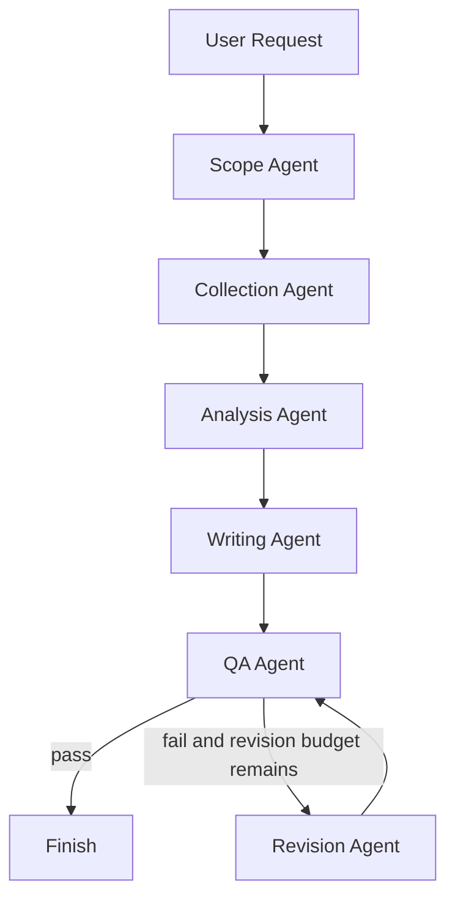

# Running V2

V2 是我们基于原项目新增的竞品分析 Agent 协作系统骨架。

## 新增 Graph

`src/langgraph.json` 中现在有两个 graph：

```json
{
    "graphs": {
        "competitive_analysis_agent": "./agent.py:competitive_analysis_agent",
        "competitive_analysis_v2": "./v2_workflow.py:competitive_analysis_v2"
    }
}
```

`competitive_analysis_agent` 是原项目 graph。

`competitive_analysis_v2` 是我们新增的 DAG 式协作系统。

## V2 文件

```text
src/competitive_schema.py
src/v2_prompts.py
src/v2_workflow.py
src/v2_cli.py
src/v2_cache.py
src/v2_smoke_test.py
OUR_PROJECT_V2_SPEC.md
examples/v2_seed_records.json
```

## 本地验证

验证配置：

```powershell
cd D:\deep-competitive-analyst\src
$env:PYTHONIOENCODING='utf-8'
& 'E:\ProgramData\anaconda3\envs\deep-competitive-analyst\Scripts\langgraph.exe' validate
```

预期结果：

```text
Configuration file D:\deep-competitive-analyst\src\langgraph.json is valid. (2 graphs found)
```

直接 invoke V2 graph：

```powershell
cd D:\deep-competitive-analyst\src
$env:PYTHONIOENCODING='utf-8'
& 'E:\ProgramData\anaconda3\envs\deep-competitive-analyst\python.exe' -c "from v2_workflow import competitive_analysis_v2; state=competitive_analysis_v2.invoke({'request':'Create a competitive analysis comparing Linear and Asana for product development teams.'}); print('trace', len(state.get('trace', []))); print('artifacts', len(state.get('artifacts', []))); print('qa_passed', state['quality_review']['passed']); print('revision_count', state['revision_count']); print(state['report_draft']['markdown'][:800])"
```

当前验证结果：

```text
trace 7
artifacts 7
qa_passed False
revision_count 1
```

`qa_passed=False` 是预期行为，因为第一阶段还没有接入真实搜索采集。系统会明确输出缺少 source/evidence，而不是伪造竞品结论。

## Seed Evidence Demo

为了在没有真实 API key 时也能展示完整证据链，V2 支持 seed records。

示例文件：

```text
D:\deep-competitive-analyst\examples\v2_seed_records.json
```

运行：

```powershell
cd D:\deep-competitive-analyst\src
$env:PYTHONIOENCODING='utf-8'
& 'E:\ProgramData\anaconda3\envs\deep-competitive-analyst\python.exe' v2_cli.py "Create a competitive analysis comparing Linear and Asana for product development teams." --seed-records ..\examples\v2_seed_records.json
```

可选开启 LLM claim generation：

```powershell
cd D:\deep-competitive-analyst\src
$env:PYTHONIOENCODING='utf-8'
$env:OPENAI_API_KEY='<your-key>'
& 'E:\ProgramData\anaconda3\envs\deep-competitive-analyst\python.exe' v2_cli.py "Create a competitive analysis comparing Linear and Asana for product development teams." --seed-records ..\examples\v2_seed_records.json --llm-analysis
```

如果没有真实 `OPENAI_API_KEY`，`--llm-analysis` 会安全回退到 deterministic claim generation，并在 trace 中记录 warning。

验证结果：

```text
Trace events: 5
Artifacts: 5
QA passed: True
Revision count: 0
```

CLI 会导出：

```text
run_outputs/v2/<timestamp>/report.md
run_outputs/v2/<timestamp>/state.json
run_outputs/v2/<timestamp>/trace.json
run_outputs/v2/<timestamp>/artifacts.json
```

这四个文件分别用于展示：

1. 最终报告。
2. 完整状态。
3. Agent 决策过程。
4. 中间产物。

## Live Collection

如果配置了真实 `PERPLEXITY_API_KEY`，可以启用 live collection：

```powershell
cd D:\deep-competitive-analyst\src
$env:PYTHONIOENCODING='utf-8'
$env:PERPLEXITY_API_KEY='<your-key>'
& 'E:\ProgramData\anaconda3\envs\deep-competitive-analyst\python.exe' v2_cli.py "Create a competitive analysis comparing Linear and Asana for product development teams." --live --max-search-queries 6
```

如果没有 API key，V2 不会尝试搜索，也不会伪造 sources。

Live collection 默认启用 query cache：

```text
.dca_cache/v2_queries/
```

可以通过参数控制：

```powershell
--no-cache
--cache-dir ..\.dca_cache\v2_queries
```

## Smoke Test

运行：

```powershell
cd D:\deep-competitive-analyst\src
$env:PYTHONIOENCODING='utf-8'
& 'E:\ProgramData\anaconda3\envs\deep-competitive-analyst\python.exe' v2_smoke_test.py
```

预期结果：

```text
V2 smoke test passed
empty_trace=7
seed_trace=5
seed_claims=4
```

## V2 DAG

Detailed architecture:

```text
D:\deep-competitive-analyst\V2_ARCHITECTURE.md
```



## 当前实现边界

已实现：

1. 自定义竞品知识 Schema。
2. DAG graph 编译。
3. Scope、Collection、Analysis、Writing、QA、Revision 节点。
4. 每个节点输出 artifact。
5. 每个节点输出 trace event。
6. QA 闭环。
7. LangGraph validate 通过。
8. Seed records 演示闭环。
9. CLI 导出 report / state / trace / artifacts。
10. Collection Agent 支持 live Perplexity 搜索的 lazy import。
11. Analysis Agent 支持可选 LLM 结构化 claim generation。
12. 无 OpenAI key 时，LLM analysis 自动回退到 deterministic claims。
13. 报告按 claim category 分组，并增加 Company Fact Sheets。
14. Source credibility scoring。
15. Live query cache。
16. Smoke test。

未实现：

1. 高质量网页内容抽取和去重。
2. 使用真实 LLM 批量调优 ClaimRecord 质量。
3. Report reviewer 高级评分。
4. Web UI。

## 下一步

优先提升 live collection 的内容抽取、去重和 source credibility scoring。随后让 Analysis Agent 在真实 OpenAI key 下批量生成更高质量的 business claims。
