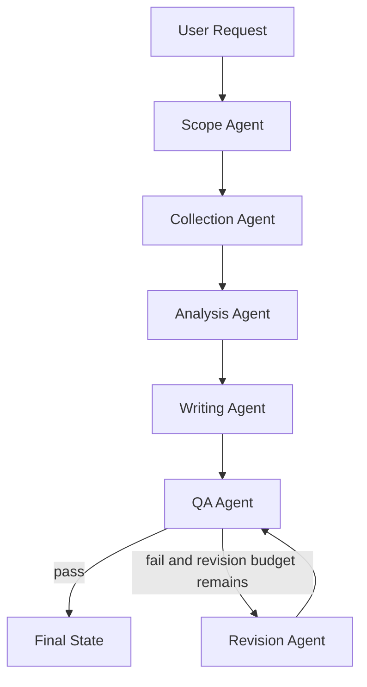
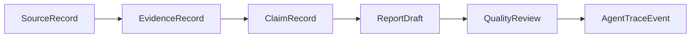

# V2 Architecture

V2 turns the original deep competitive analyst demo into a traceable multi-agent competitive intelligence workflow.

## Design Goal

The system should not merely generate a polished report. It should make every conclusion inspectable:

```text
source -> evidence -> claim -> report -> QA review
```

If evidence is missing, the system must fail transparently instead of inventing business conclusions.

## DAG



## Agent Responsibilities

| Agent | Responsibility | Output |
|---|---|---|
| Scope Agent | Extract companies, focus areas, audience, depth, open questions | `ResearchPlan` |
| Collection Agent | Load seed evidence or run live Perplexity collection | `CompetitorKnowledgeBase` |
| Analysis Agent | Generate evidence-backed claims only | `ClaimRecord[]` |
| Writing Agent | Produce report with evidence table and source inventory | `ReportDraft` |
| QA Agent | Check citation coverage, source quality, balance, format | `QualityReview` |
| Revision Agent | Add transparent QA notes without inventing evidence | revised `ReportDraft` |

## Schema Flow



## Source Credibility

Each `SourceRecord` includes:

```text
source_type
credibility_score
credibility_label
reliability_note
```

Current heuristic examples:

| Source Type | Default Label | Default Score |
|---|---|---:|
| official | high | 0.90 |
| analyst | high | 0.82 |
| database | medium | 0.72 |
| press | medium | 0.68 |
| review | medium | 0.55 |
| social | low | 0.35 |
| unknown | unknown | 0.45 |

## Cache

Live collection uses a local JSON query cache by default:

```text
.dca_cache/v2_queries/
```

This is intentionally outside committed source files. It reduces repeated Perplexity calls for the same query and makes iterative development cheaper.

## Observability

Every node appends:

1. `AgentArtifact`
2. `AgentTraceEvent`

CLI exports:

```text
report.md
state.json
trace.json
artifacts.json
```

This makes the system inspectable at the workflow, data, and report levels.

## Safety Principles

1. No evidence, no claim.
2. No source URL, no trusted evidence.
3. LLM analysis must produce structured claims.
4. LLM failures fall back to deterministic evidence summaries.
5. QA can block or annotate low-quality outputs.

## Demo

Seed demo without API keys:

```powershell
cd D:\deep-competitive-analyst\src
$env:PYTHONIOENCODING='utf-8'
& 'E:\ProgramData\anaconda3\envs\deep-competitive-analyst\python.exe' v2_cli.py "Create a competitive analysis comparing Linear and Asana for product development teams." --seed-records ..\examples\v2_seed_records.json --llm-analysis
```

Smoke test:

```powershell
cd D:\deep-competitive-analyst\src
$env:PYTHONIOENCODING='utf-8'
& 'E:\ProgramData\anaconda3\envs\deep-competitive-analyst\python.exe' v2_smoke_test.py
```

